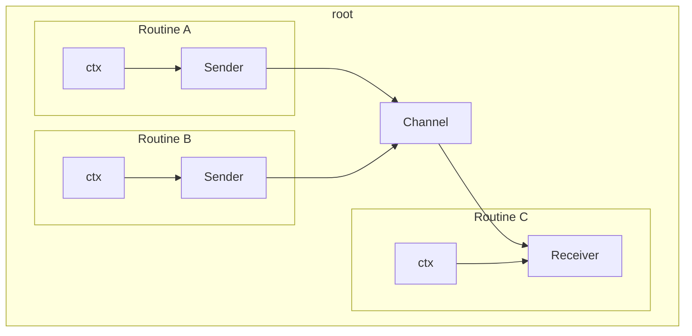
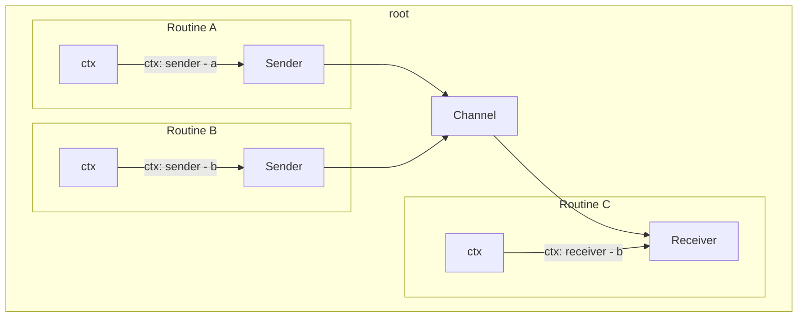
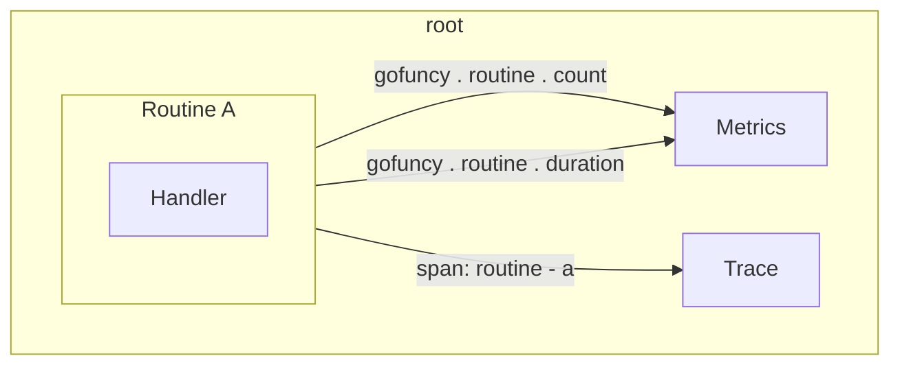

# gofuncy

[](https://github.com/foomo/gofuncy/actions/workflows/test.yml)
[](https://goreportcard.com/report/github.com/foomo/gofuncy)
[](https://godoc.org/github.com/foomo/gofuncy)
[](https://github.com/foomo/gofuncy/actions)

> Stop using `go func`, start using `gofuncy`!

- ctx as a first class citizen
- error return as a first class citizen
- optional: enable telemetry (metrics & traces)
  - `gofuncy.routine.count` counter
  - `gofuncy.routine.duration` histogram
  - `gofuncy.channel.sent.count` counter
  - `gofuncy.channel.sent.duration` histogram

## Configuration

Environment variables:

- `OTEL_ENABLED`: enable telemetry
- `GOFUNCY_CHANNEL_VALUE_EVENTS_ENABLED`: creates a span event for every value sent into the channel
- `GOFUNCY_CHANNEL_VALUE_ATTRIBUTE_ENABLED`: adds the json dump of the data to the span event

## Usage

From:

```go
package main

func main() {
  go func() {
    numbers, err := GenerateNumbers(5)
    if err != nil {
      panic(err)
    }
  }()
}
```

To:

```go
package main

import (
  "github.com/foomo/gofuncy"
)

func main() {
  errChan := gofuncy.Go(func(ctx context.Context) error {
    numbers, err := GenerateNumbers(5)
    return err
  })
  if err := <-errChan; err != nil {
    panic(err)
  }
}
```

## Concept

### Routines

#### Error

Each routine can return an error that is being returned through an error channel:

```go
errChan := gofuncy.Go(func (ctx context.Context) error {
return nil
})

if err := <- errChan; err != nil {
panic(err)
}
```

#### Context

Each routine will receive its own base context, which can be set:

```go
errChan := gofuncy.Go(send(msg), gofuncy.WithContext(context.Background()))
```



#### Names

Using the context we will inject a name for the process so that it can always be identified:



#### Telemetry

Metrics:

| Name                       | Type          |
|----------------------------|---------------|
| `gofuncy.routine.count`    | UpDownCounter |
| `gofuncy.routine.duration` | Histogram     |



## How to Contribute

Please refer to the [CONTRIBUTING](.gihub/CONTRIBUTING.md) details and follow the [CODE_OF_CONDUCT](.gihub/CODE_OF_CONDUCT.md) and [SECURITY](.github/SECURITY.md) guidelines.

## License

Distributed under MIT License, please see license file within the code for more details.

_Made with ♥ [foomo](https://www.foomo.org) by [bestbytes](https://www.bestbytes.com)_
